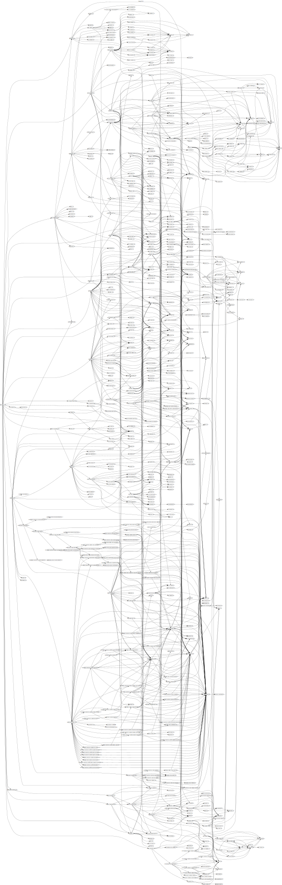
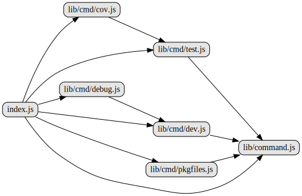

# egg-bin

[![NPM version][npm-image]][npm-url]
[![build status][travis-image]][travis-url]
[![Test coverage][codecov-image]][codecov-url]
[![David deps][david-image]][david-url]
[![Known Vulnerabilities][snyk-image]][snyk-url]
[![npm download][download-image]][download-url]

[npm-image]: https://img.shields.io/npm/v/egg-bin.svg?style=flat-square
[npm-url]: https://npmjs.org/package/egg-bin
[travis-image]: https://img.shields.io/travis/eggjs/egg-bin.svg?style=flat-square
[travis-url]: https://travis-ci.org/eggjs/egg-bin
[codecov-image]: https://codecov.io/gh/eggjs/egg-bin/branch/master/graph/badge.svg
[codecov-url]: https://codecov.io/gh/eggjs/egg-bin
[david-image]: https://img.shields.io/david/eggjs/egg-bin.svg?style=flat-square
[david-url]: https://david-dm.org/eggjs/egg-bin
[snyk-image]: https://snyk.io/test/npm/egg-bin/badge.svg?style=flat-square
[snyk-url]: https://snyk.io/test/npm/egg-bin
[download-image]: https://img.shields.io/npm/dm/egg-bin.svg?style=flat-square
[download-url]: https://npmjs.org/package/egg-bin

egg developer tool, extends [common-bin].

# 源码分析

提供一些cli命令，继承自common-bin模块。

封装了dev、test等cli命令。

## 文件结构

``` bash
├── bin
|  ├── egg-bin.js - 注册命令egg-bin，调用index.js的start()方法
|  ├── ets.js - 注册ets命令，使用egg-ts-helper的bin
|  └── mocha.js - 注册mocha命令，使用mocha
├── index.js - 继承自lib/command.js的Command，将lib/cmd文件夹自内容load，对外暴露各种命令。
├── lib
|  ├── cmd - 文件下所有命令通过common-bin模块的load加载到命令列表
|  |  ├── autod.js - 对autod模块的bin/autod.js套一层，使用common-bin的helper.forkNode来fork一个子进程执行autod命令。
|  |  ├── cov.js - 对nyc模块的bin/nyc.js套一层，使用common-bin的helper.forkNode来fork一个子进程执行nyc命令。
|  |  ├── debug.js - 提供debug命令，调试功能
|  |  ├── dev.js - 提供dev命令，启动进程
|  |  ├── pkgfiles.js - 提供pkgfiles命令，生成pkg.files
|  |  └── test.js - 底层调用mocha
|  ├── command.js - 继承自common-bin模块，作为lib/cmd下各class的基类。
|  ├── mocha-clean.js
|  └── start-cluster - 调用framework.startCluster启动单进程
```

---

## 外部模块依赖



### 核心模板依赖源码分析

- [common-bin源码分析](https://github.com/FunnyLiu/common-bin/tree/readsource)

## 内部模块依赖



## 逐个文件分析


### bin/egg-bin.js

注册命令egg-bin，调用index.js的start()方法。

### bin/ets.js

注册ets命令，使用egg-ts-helper的bin。

### bin/mocha.js

注册mocha命令，使用mocha。


### index.js

继承自lib/command.js的Command，将lib/cmd文件夹内容load。

对外暴露各种命令。

### lib/command.js

继承自common-bin模块，根据参数提供各环境变量到context上。

### lib/cmd/autod.js

对autod模块的bin/autod.js套一层，使用common-bin的helper.forkNode来fork一个子进程执行autod命令。

### lib/cmd/cov.js

继承自lib/cmd/test.js。

对nyc模块的bin/nyc.js套一层，使用common-bin的helper.forkNode来fork一个子进程执行nyc命令。


### lib/cmd/debug.js

继承自lib/cmd/dev.js。

同样调用start-cluster.js文件作为子进程命令，env.EGG_DEBUG为true。

基于inspector-proxy模块代理调试。

### lib/cmd/dev.js

调用start-cluster.js文件作为子进程命令。

挂载framework到argv上。framework取自egg-utils的getFrameworkPath()方法。

### lib/cmd/test.js

底层调用mocha。

### lib/start-cluster

调用argv上的framework.startCluster启动单进程。

其中framework来自lib/cmd/dev.js中挂载到argv上的。

---

## Install

```bash
$ npm i egg-bin --save-dev
```

## Usage

Add `egg-bin` to `package.json` scripts:

```json
{
  "scripts": {
    "dev": "egg-bin dev",
    "debug": "egg-bin debug",
    "test-local": "egg-bin test",
    "test": "npm run lint -- --fix && npm run test-local",
    "cov": "egg-bin cov",
    "lint": "eslint .",
    "pkgfiles": "egg-bin pkgfiles",
    "autod": "egg-bin autod",
    "ci": "npm run lint && npm run autod -- --check && npm run pkgfiles -- --check && npm run cov"
  }
}
```

## Command

All the commands support these specific v8 options:

- `--debug`
- `--inspect`
- `--harmony*`
- `--es_staging`

```bash
$ egg-bin [command] --debug --es_staging
```

if `process.env.NODE_DEBUG_OPTION` is provided (WebStorm etc), will use it as debug options.

### dev

Start dev cluster on `local` env, it will start a master, an agent and a worker.

```bash
$ egg-bin dev
```

##### options

- `--framework` egg web framework root path.
- `--baseDir` application's root path, default to `process.cwd()`.
- `--port` server port, default to `7001`.
- `--workers` worker process number, default to `1` worker at local mode.
- `--sticky` start a sticky cluster server, default to `false`.
- `--typescript` / `--ts` enable typescript support, default to `false`. Also support read from `package.json`'s `egg.typescript`.
- `--declarations` / `--dts` enable [egg-ts-helper](https://github.com/whxaxes/egg-ts-helper) support, default to `false`. Also support read from `package.json`'s `egg.declarations`.
- `--require` will add to `execArgv`, support multiple. Also support read from `package.json`'s `egg.require`

### debug

Debug egg app with [V8 Inspector Integration](https://nodejs.org/api/debugger.html#debugger_v8_inspector_integration_for_node_js).

automatically detect the protocol, use the new `inspector` when the targeted runtime >=7.0.0 .

if running without `VSCode` or `WebStorm`, we will use [inspector-proxy](https://github.com/whxaxes/inspector-proxy) to proxy worker debug, so you don't need to worry about reload.

```bash
$ egg-bin debug --debug-port=9229 --proxy=9999
```

##### options

- all `egg-bin dev` options is accepted.
- `--proxy=9999` worker debug proxy port.


### test

Using [mocha] with [co-mocha] to run test.

[power-assert] is the default `assert` library, and [intelli-espower-loader] will be auto required.

```bash
$ egg-bin test [files] [options]
```

- `files` is optional, default to `test/**/*.test.js`
- `test/fixtures`, `test/node_modules` is always exclude.

#### auto require `test/.setup.js`

If `test/.setup.js` file exists, it will be auto require as the first test file.

```js
test
  ├── .setup.js
  └── foo.test.js
```

#### options

You can pass any mocha argv.

- `--require` require the given module
- `--grep` only run tests matching <pattern>
- `--timeout` milliseconds, default to 60000
- `--full-trace` display the full stack trace, default to false.
- `--typescript` / `--ts` enable typescript support, default to `false`.
- `--changed` / `-c` only test changed test files(test files means files that match `${pwd}/test/**/*.test.(js|ts)`)
- see more at https://mochajs.org/#usage

#### environment

Environment is also support, will use it if options not provide.

You can set `TESTS` env to set the tests directory, it support [glob] grammar.

```bash
TESTS=test/a.test.js egg-bin test
```

And the reporter can set by the `TEST_REPORTER` env, default is `spec`.

```bash
TEST_REPORTER=doc egg-bin test
```

The test timeout can set by `TEST_TIMEOUT` env, default is `60000` ms.

```bash
TEST_TIMEOUT=2000 egg-bin test
```

### cov

Using [nyc] to run code coverage, it support all test params above.

Coverage reporter will output text-summary, json and lcov.

#### options

You can pass any mocha argv.

- `-x` add dir ignore coverage, support multiple argv
- `--prerequire` prerequire files for coverage instrument, you can use this options if load files slowly when call `mm.app` or `mm.cluster`
- `--typescript` / `--ts` enable typescript support, default to `false`, if true, will auto add `.ts` extension and ignore `typings` and `d.ts`.
- `--nyc` nyc instruments passthrough. you can use this to overwrite egg-bin's default nyc instruments and add additional ones.
  > if you want to add addtional `nyc` reporters, you need to use this rather than add `reporter` key in `.nycrc` because:
  > - when same key exists in `.nycrc` and cmd instruments, nyc prefers instrument.
  > - egg-bin have some default instruments passed to nyc like `-r` and `--temp-directory`
  > - `egg-bin cov --nyc="-r teamcity -r text"`

- also support all test params above.

#### environment

You can set `COV_EXCLUDES` env to add dir ignore coverage.

```bash
$ COV_EXCLUDES="app/plugins/c*,app/autocreate/**" egg-bin cov
```

### pkgfiles

Generate `pkg.files` automatically before npm publish, see [ypkgfiles] for detail

```bash
$ egg-bin pkgfiles
```

### autod

Generate `pkg.dependencies` and `pkg.devDependencies` automatically, see [autod] for detail

```bash
$ egg-bin autod
```

## Custom egg-bin for your team

You maybe need a custom egg-bin to implement more custom features if your team has develop a framework base on egg.

Now you can implement a [Command](lib/command.js) sub class to do that.
Or you can just override the exists command.

See more at [common-bin].

### Example: Add [nsp] for security scan

[nsp] has provide a useful security scan feature.

This example will show you how to add a new `NspCommand` to create a new `egg-bin` tool.

- Full demo: [my-egg-bin](test/fixtures/my-egg-bin)

#### [my-egg-bin](test/fixtures/my-egg-bin/index.js)

```js
const EggBinCommand = require('egg-bin');

class MyEggBinCommand extends EggBinCommand {
  constructor(rawArgv) {
    super(rawArgv);
    this.usage = 'Usage: egg-bin [command] [options]';

    // load directory
    this.load(path.join(__dirname, 'lib/cmd'));
  }
}

module.exports = MyEggBinCommand;
```

#### [NspCommand](test/fixtures/my-egg-bin/lib/cmd/nsp.js)

```js
const Command = require('egg-bin').Command;

class NspCommand extends Command {
  * run({ cwd, argv }) {
    console.log('run nsp check at %s with %j', cwd, argv);
  }

  description() {
    return 'nsp check';
  }
}

module.exports = NspCommand;
```

#### [my-egg-bin.js](test/fixtures/my-egg-bin/bin/my-egg-bin.js)

```js
#!/usr/bin/env node

'use strict';
const Command = require('..');
new Command().start();
```

#### Run result

```bash
$ my-egg-bin nsp

run nsp check at /foo/bar with {}
```

## License

[MIT](LICENSE)


[mocha]: https://mochajs.org
[co-mocha]: https://npmjs.com/co-mocha
[glob]: https://github.com/isaacs/node-glob
[istanbul]: https://github.com/gotwarlost/istanbul
[nsp]: https://npmjs.com/nsp
[iron-node]: https://github.com/s-a/iron-node
[intelli-espower-loader]: https://github.com/power-assert-js/intelli-espower-loader
[power-assert]: https://github.com/power-assert-js/power-assert
[ypkgfiles]: https://github.com/popomore/ypkgfiles
[common-bin]: https://github.com/node-modules/common-bin
[autod]: https://github.com/node-modules/autod
